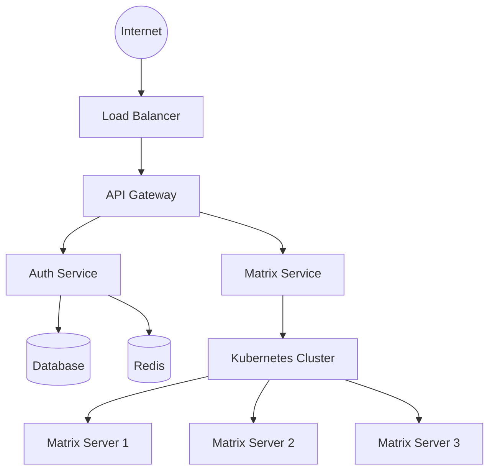

# Deployment Guide

## Infrastructure Overview

```mermaid
graph TB
    Internet((Internet)) --> LB[Load Balancer]
    LB --> API[API Gateway]
    API --> Auth[Auth Service]
    API --> Matrix[Matrix Service]
    Auth --> DB[(Database)]
    Auth --> Cache[(Redis)]
    Matrix --> K8S[Kubernetes Cluster]
    K8S --> MS1[Matrix Server 1]
    K8S --> MS2[Matrix Server 2]
    K8S --> MS3[Matrix Server 3]
```

[Rest of the deployment guide content...]